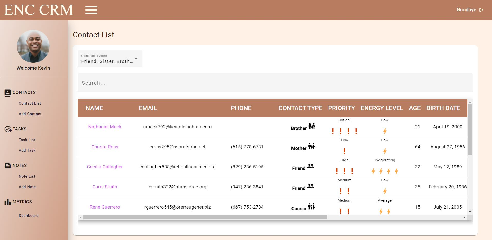

<p align="center">

  <h3 align="center">Encouragement CRM</h3>

  <p align="center">
    A Personal CRM to Promote Encouragement Amongst Your Network
    <br />
    <a href="https://github.com/kevinmilly/encourage-crm"><strong>Explore the docs »</strong></a>
    <br />
    <br />
    <!-- <a href="readme-assets/">View Demo</a> -->
    ·
    <a href="https://github.com/kevinmilly/encourage-crm/issues">Report Bug</a>
    ·
    <a href="https://github.com/kevinmilly/encourage-crm/issues">Request Feature</a>
  </p>
</p>


<!-- TABLE OF CONTENTS -->
<details open="open">
  <summary>Table of Contents</summary>
  <ol>
    <li>
      <a href="#about-the-project">About The Project</a>
        <li><a href="#roadmap">Roadmap</a></li>
      <ul>
        <li><a href="#built-with">Built With</a></li>
      </ul>
    </li>
    <li>
      <a href="#getting-started">Getting Started</a>
      <ul>
        <li><a href="#end-user-setup">End User Setup</a></li>
        <li><a href="#developer-setup">Developer Setup</a></li>
      </ul>
    </li>
    <li><a href="#contributing">Contributing</a></li>
    <li><a href="#license">License</a></li>
    <li><a href="#contact">Contact</a></li>
    <li><a href="#acknowledgements">Acknowledgements</a></li>
  </ol>
</details>


<!-- ABOUT THE PROJECT -->
## About The Project


<!--  -->

#### Step 1


#### Step 2


#### Step 3


<!-- ROADMAP -->
## Roadmap


<!-- GETTING STARTED -->
## Getting Started

### End User Setup


### Developer Setup

1. Clone the repo
   ```sh
   git clone https://github.com/kevinmilly/encourage-crm.git
   ```
2. Install NPM packages
   ```sh
   npm install
   ```

### Built With

* [Angular](https://ionicframework.com/docs/angular/your-first-app)
* [Firebase](https://firebase.google.com/)


<!-- CONTRIBUTING -->
## Contributing

Contributions are what make the open source community such an amazing place to be learn, inspire, and create. Any contributions you make are **greatly appreciated**.

Please feel free to contribute through code or through theory.  Everyone has their own thoughts in regards to how we can all become more productivity.  If you have thoughts in regards to ideas, please feel free to 'Create an Issue' or give feedback through a feature suggestion.


1. Fork the Project
2. Create your Feature Branch (`git checkout -b feature/AmazingFeature`)
3. Commit your Changes (`git commit -m 'Add some AmazingFeature'`)
4. Push to the Branch (`git push origin feature/AmazingFeature`)
5. Open a Pull Request


<!-- LICENSE -->
## License

Distributed under the MIT License. See `LICENSE` for more information.


<!-- CONTACT -->
## Contact

Kevin Smith - [Connect with me on LinkedIn](https://www.linkedin.com/in/ksmithtech/) - https://www.linkedin.com/in/ksmithtech/

Email me at: kevinmilly@gmail.com


