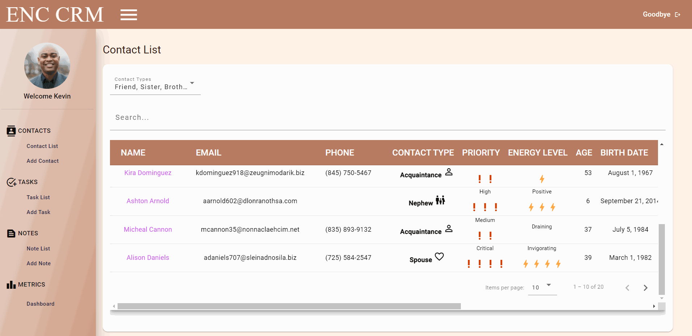
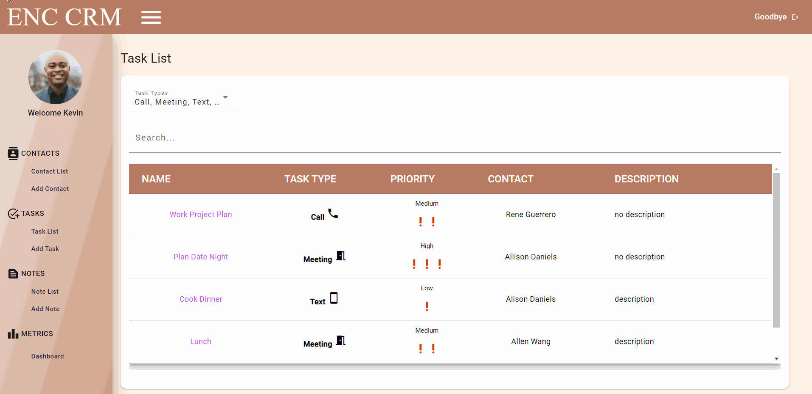
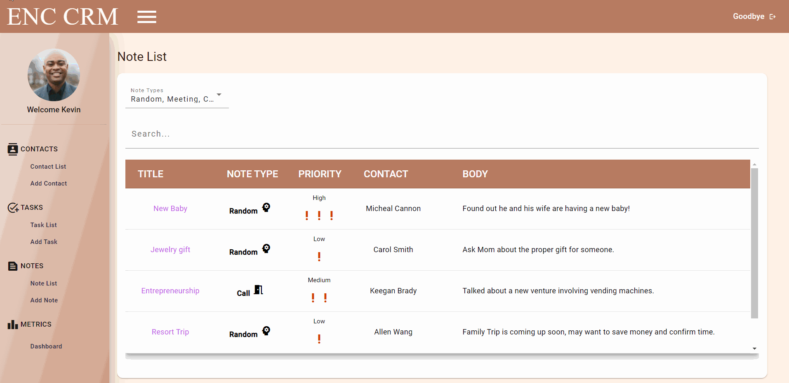

<p align="center">

  <h3 align="center">Encouragement CRM</h3>

  <p align="center">
    A Personal CRM to Promote Encouragement Amongst Your Network
    <br />
    <a href="https://github.com/kevinmilly/encourage-crm"><strong>Explore the docs »</strong></a>
    <br />
    <br />
    <!-- <a href="readme-assets/">View Demo</a> -->
    ·
    <a href="https://github.com/kevinmilly/encourage-crm/issues">Report Bug</a>
    ·
    <a href="https://github.com/kevinmilly/encourage-crm/issues">Request Feature</a>
  </p>
</p>


<!-- TABLE OF CONTENTS -->
<details open="open">
  <summary>Table of Contents</summary>
  <ol>
    <li>
      <a href="#about-the-project">About The Project</a>
        <li><a href="#roadmap">Roadmap</a></li>
      <ul>
        <li><a href="#built-with">Built With</a></li>
      </ul>
    </li>
    <li>
      <a href="#getting-started">Getting Started</a>
      <ul>
        <li><a href="#end-user-setup">End User Setup</a></li>
        <li><a href="#developer-setup">Developer Setup</a></li>
      </ul>
    </li>
    <li><a href="#contributing">Contributing</a></li>
    <li><a href="#license">License</a></li>
    <li><a href="#contact">Contact</a></li>
    <li><a href="#acknowledgements">Acknowledgements</a></li>
  </ol>
</details>


<!-- ABOUT THE PROJECT -->
## About The Project

  
  
  CRMs help many businesses track their contacts to manage leads and current clients.  That's because they effectively offer visibility on a large and small scale.  Just like     CRMs help companies towards their goal of profit; I wanted to work on a Personal CRM, with the goal of encouragement and relationship maximization.  
  
  Personal CRMS aren't new however, I wanted to really focus on assisting the user through more actionable metrics.  The CRM would be more than just a database of contacts, but   it would emulate a business-oriented CRM; giving molding data into information that you can make decisions from.  These decisions could help you enrich your network and      identify relationships that may need some work.
  
  

#### View all your contacts

You can view all the contacts holistically on the table view.
Sort or filter by the different factors that you have used to categorize your contacts.


#### Concept Detail

Drill down into a contact to see their related notes and tasks; including some additional personalized information.



#### Add New Contacts

Easily add more contacts to track.  

#### Tasks and Notes

| Tasks | Notes |
| --- | --- |
|  |  |

Setup tasks that are related to your contacts or take notes based on conversations.  

#### Analytics



Here's where it all comes together!  View the meaningful metrics at a glance based on your contact creation activity.


<!-- ROADMAP -->
## Roadmap

- More work on the UI enhancement issues
- More work on state management

- Add 'Encouragement' features
  - Based on contact type, bring in information on contact detail view to nurture the relationship 
  - Contact pipeline (facilitate relationship building tracking)
  - Add reminders for important dates
  - Google Calendar integration
  - Gmail integration

- User convenience
  - Contact Import/Export

- More Contact Detail Metrics/Highlights


<!-- GETTING STARTED -->
## Getting Started

### End User Setup

Launching Soon


### Developer Setup

1. Clone the repo
   ```sh
   git clone https://github.com/kevinmilly/encourage-crm.git
   ```
2. Install NPM packages
   ```sh
   npm install
   ```

### Built With

* [Angular]
* [Firebase](https://firebase.google.com/)


<!-- CONTRIBUTING -->
## Contributing

Contributions are what make the open source community such an amazing place to be learn, inspire, and create. Any contributions you make are **greatly appreciated**.


1. Fork the Project
2. Create your Feature Branch (`git checkout -b feature/AmazingFeature`)
3. Commit your Changes (`git commit -m 'Add some AmazingFeature'`)
4. Push to the Branch (`git push origin feature/AmazingFeature`)
5. Open a Pull Request


<!-- LICENSE -->
## License

Distributed under the MIT License. See `LICENSE` for more information.


<!-- CONTACT -->
## Contact

Kevin Smith - [Connect with me on LinkedIn](https://www.linkedin.com/in/ksmithtech/) - https://www.linkedin.com/in/ksmithtech/

Email me at: kevinmilly@gmail.com


